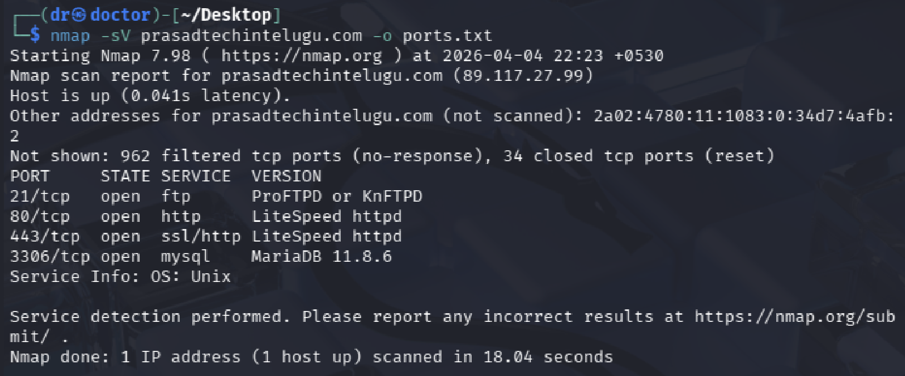
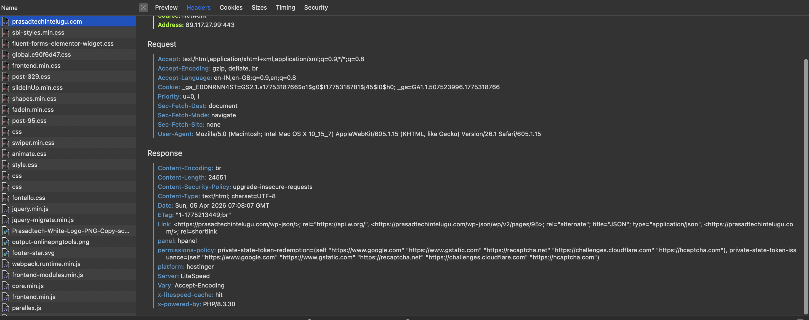

# 🔐 Vulnerability Assessment Report  
### Cyber Security Task 1 (2026) – Future Interns

---

## 📄 Quick Access

👉 **View Full Report:**  
[Open Vulnerability Report](./VulnerabilityReport.pdf)

---

## 📌 Overview

This repository contains a **Vulnerability Assessment Report** conducted as part of **Cyber Security Task 1 by Future Interns**.

The objective of this task was to analyze a live website using **passive, non-intrusive techniques**, identify security weaknesses, and present findings in a **clear, business-friendly format**.

This assessment strictly follows ethical guidelines and does **not involve exploitation or active attacks**.

---

## 🎯 Target Website

https://prasadtechintelugu.com/

---

## 🎯 Objective

- Analyze a public website for security weaknesses  
- Classify risks (Low / Medium / High)  
- Explain issues clearly in simple language  
- Suggest practical remediation steps  
- Present findings in a professional report  

---

## ⚠️ Scope & Ethics

This assessment follows a **read-only (passive) approach**.

### ✅ Allowed
- Public-facing pages analysis  
- Header and cookie inspection  
- Port scanning (non-intrusive)  
- Configuration analysis  

### ❌ Not Allowed
- Exploitation or attacks  
- Login bypass or brute force  
- Denial-of-Service (DoS)  
- Any harmful activity  

> This project demonstrates **security auditing, not hacking**

---

## 🛠️ Tools Used

- **Nmap** – Port scanning & service detection  
- **Browser DevTools** – Header & cookie analysis  
- **Canva** – Report design  

---

## 🔍 Methodology

The assessment was conducted using passive techniques:

- Nmap scan to identify open ports and services  
- Browser DevTools to inspect headers and cookies  
- Manual analysis of public endpoints  

No intrusive testing or exploitation was performed.

---

## 🚨 Key Findings Summary

| Risk Level | Count |
|-----------|------|
| 🔴 High Risk | 2 |
| 🟠 Medium Risk | 4 |
| 🟢 Low Risk | 4 |
| 🟡 Low–Medium | 1 |

---

## 📋 Major Vulnerabilities Identified

### 🔴 High Risk
- FTP service exposed on port 21  
- MySQL database exposed on port 3306  

### 🟠 Medium Risk
- Multiple exposed services  
- Weak Content Security Policy  
- Missing security headers  
- Insecure cookie configuration  

### 🟡 Low–Medium Risk
- WordPress REST API exposure  

### 🟢 Low Risk
- Server information disclosure  
- PHP version disclosure  
- Sitemap exposure  
- HTTP service enabled  

---

## 📄 Vulnerability Report Preview

📥 Click the preview to open the full report

---

## 📸 Evidence

### 🔍 Nmap Scan Result

### 🌐 Header Analysis

---

## 📂 Repository Contents

- VulnerabilityReport.pdf  
- preview.png  
- nmap_scan.png  
- headers_analysis.png  
- README.md  

---

## 🧠 About the Task

Every business today owns a website — but many are not secure.

Common issues include:
- Outdated frameworks or plugins  
- Misconfigured security headers  
- Exposure of sensitive information  

Clients typically ask:
- Is my website safe?  
- What are the risks?  
- What should be fixed first?  

This task focuses on answering these questions through **ethical security analysis**.

---

## 📤 Final Deliverables

- Vulnerability Assessment Report (PDF)  
- Supporting Evidence (Screenshots)  
- GitHub Repository with:
  - Report  
  - Evidence  
  - README  

---

## 💡 Learning Outcome

- Performed ethical vulnerability assessment  
- Identified real-world misconfigurations  
- Practiced risk classification  
- Developed security consulting mindset  

---

## 🌟 About Future Interns

Cyber Security Task 1 (2026)  
By Future Interns  

🔗 https://www.linkedin.com/company/future-interns

---

## 👨‍💻 Author

**Deekshith G**

---

## ⚠️ Disclaimer

This project is for educational purposes only.  
All analysis was conducted using passive techniques.  
No exploitation or harmful activity was performed.

---
